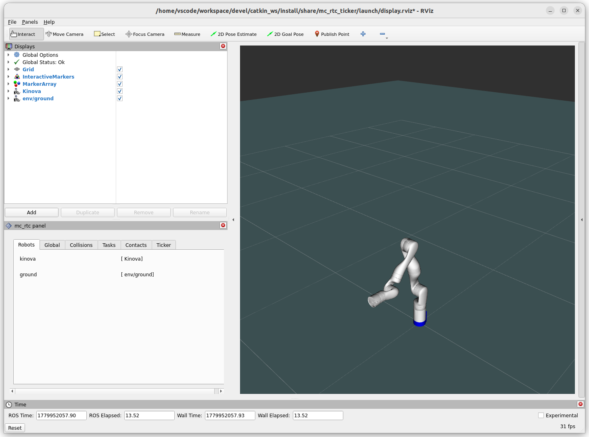

mc_kinova
==

mc_rtc robot module for Kinova Gen3 robot with various tool attachments: camera, gripper, bota sensor, etc.

Available robots:
- Kinova
- KinovaCamera
- KinovaGripper (optional)
- KinovaCameraGripper (optional)
- KinovaBota (optional)
- KinovaBotaDS4 (optional)
- KinovaBotaPlate (optional)
- KinovaBotaScrew (optional)

All robots have their floating base variation available: <robot-name>FloatingBase

## Dependencies

- [ROS2](https://docs.ros.org/)

- [mc_rtc](https://jrl-umi3218.github.io/mc_rtc/)

Description packages:

- [kortex_description](https://github.com/Kinovarobotics/ros2_kortex)

- [robotiq_description](https://github.com/PickNikRobotics/ros2_robotiq_gripper) (if include gripper)
  - Checkout this commit: 12e623212e6891a5fcc9af94d67b07e640916394

- [bota_driver](https://gitlab.com/botasys/drivers/bota_driver_ros2) (if include bota sensor)

```sh
mkdir -p ros2_ws/src && cd ros2_ws/src

git clone https://github.com/Kinovarobotics/ros2_kortex.git
git clone https://github.com/PickNikRobotics/ros2_robotiq_gripper.git
git clone https://gitlab.com/botasys/drivers/bota_driver_ros2.git

cd ros2_robotiq_gripper
git checkout 12e623212e6891a5fcc9af94d67b07e640916394

cd ../..
colcon build --symlink-install \
  --packages-select \
    kortex_description \
    robotiq_description \
    bota_driver \
  --cmake-args -Wno-dev

source "install/setup.zsh"
```

## Build and Install

```sh
git clone https://github.com/isri-aist/mc_kinova.git
cd mc_kinova
mkdir -p build && cd build
cmake ..
make -j$(nproc)
sudo make install
cd ..
```

To test the module is installed correctly

```sh
mc_rtc_ticker -f etc/mc_rtc.yaml
```
<p align="center">
  
</p>
